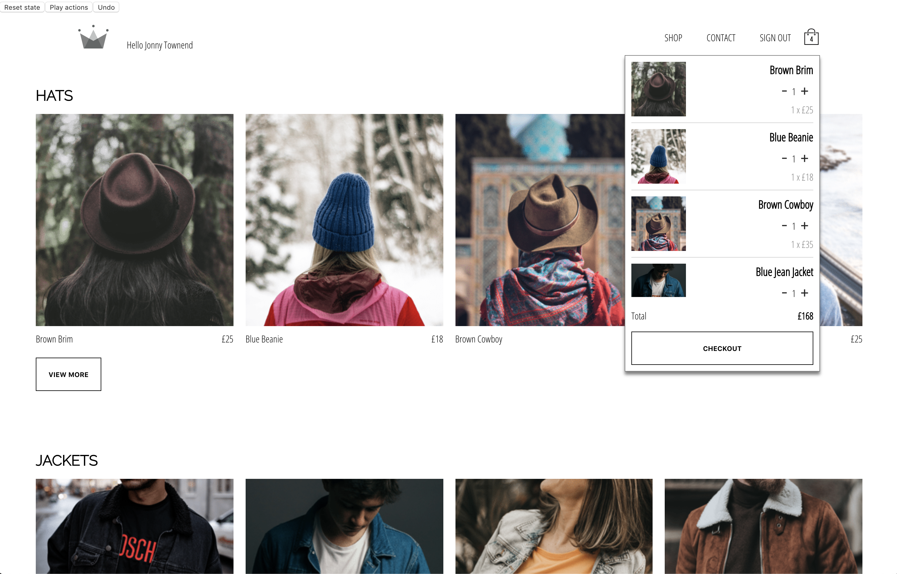

# CRWN Clothing Demo
A demo clothing store web app written in JavaScript using React and Redux. This demo is based on the master project that forms part of Udemy's [Complete React Developer in 2020](https://www.udemy.com/course/complete-react-developer-zero-to-mastery/) course.

### References
This project was bootstrapped with [Create React App](https://github.com/facebook/create-react-app).